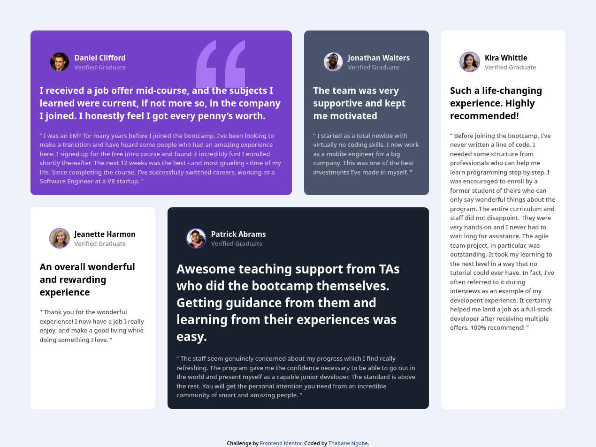

# Frontend Mentor - Testimonials grid section solution

This is a solution to the [Testimonials grid section challenge on Frontend Mentor](https://www.frontendmentor.io/challenges/testimonials-grid-section-Nnw6J7Un7). Frontend Mentor challenges help you improve your coding skills by building realistic projects. 

## Table of contents

- [Overview](#overview)
  - [The challenge](#the-challenge)
  - [Screenshot](#screenshot)
  - [Links](#links)
- [My process](#my-process)
  - [Built with](#built-with)
  - [What I learned](#what-i-learned)
  - [Continued development](#continued-development)
  - [Useful resources](#useful-resources)
- [Author](#author)
- [Acknowledgments](#acknowledgments)


## Overview

### The challenge

Users should be able to:

- View the optimal layout for the site depending on their device's screen size

### Screenshot
#### Desktop



### Links
- Live URL: [Vercel](https://grid-testify.vercel.app/)
- Solution URL: [Frontend Mentor](https://www.frontendmentor.io/solutions/a-mobilefirst-responsive-testimonials-grid-using-css-grid-kEkiKgYn_L)

## My process

### Built with

- Semantic HTML5 markup
- CSS custom properties
- Flexbox
- CSS Grid
- Mobile-first workflow

### What I learned

So, during this project, I encountered a challenge with the testimonials section overflowing on smaller screens. To tackle this, I delved into responsive design, employing a media query for screens up to 755 pixels wide. Within this query, I made grid adjustments specifically for smaller screens, ensuring the testimonials remain well-structured and readable. This experience taught me the importance of responsive design and how to adapt layouts effectively across various screen sizes.
```css
@media (max-width: 755px) {
    /* Adjust grid placement for smaller screens */
    .testimony:nth-of-type(1) {
        /* Styles for first testimony */
    }

    .testimony:nth-of-type(3) {
        /* Styles for third testimony */
    }

    /* Additional adjustments as needed */
}


```

### Continued development

Focus: Responsive design, clear class naming, mastering CSS Grid.

### Useful resources

- [W3Schools CSS Grid Documentation](https://www.w3schools.com/css/css_grid.asp): The CSS Grid documentation on W3Schools was an essential reference for learning about CSS Grid properties and techniques. It provided clear explanations and examples that greatly aided in my understanding and implementation of CSS Grid in the project.

## Author
- Frontend Mentor - [@Thabanengobe](https://www.frontendmentor.io/profile/Thabanengobe)

## Acknowledgments

- [YouTube Tutorial: CSS Grid Crash Course](https://www.youtube.com/watch?v=0xMQfnTU6oo) by Traversy Media This video tutorial provided valuable insights into mastering CSS Grid, helping me better understand its capabilities and apply them effectively to the project. Highly recommended for anyone looking to enhance their CSS Grid skills.

